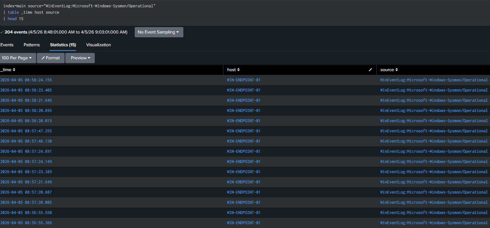
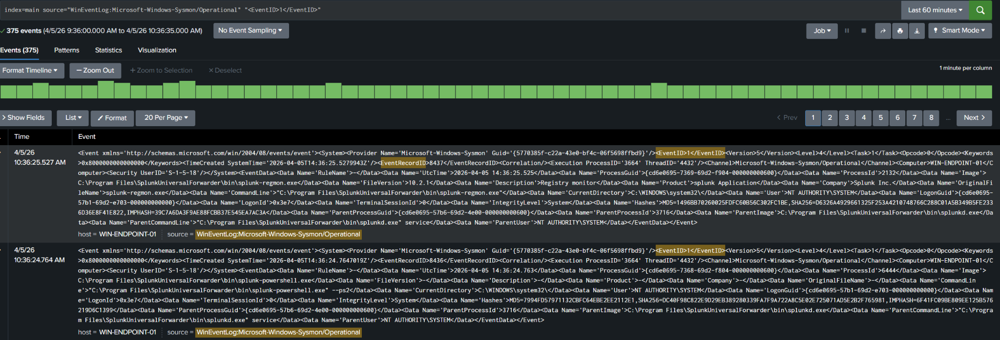
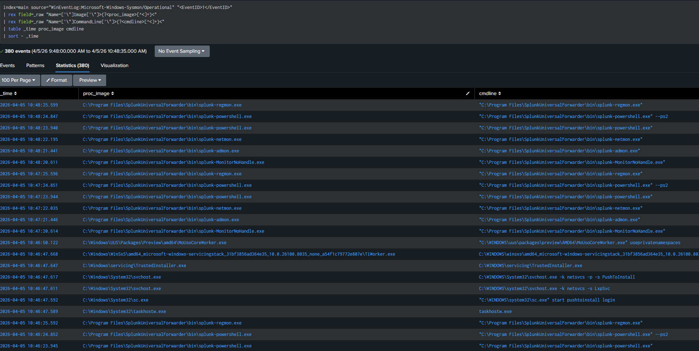
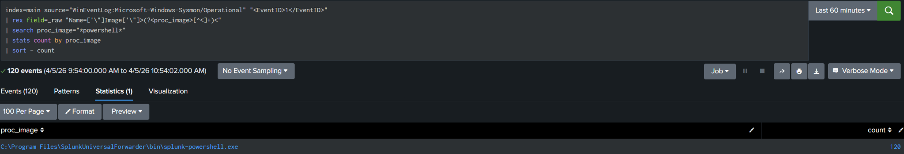
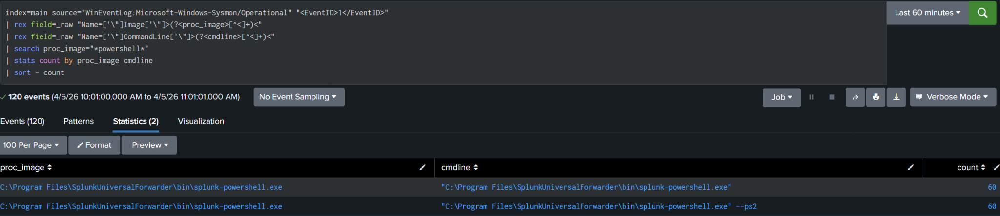
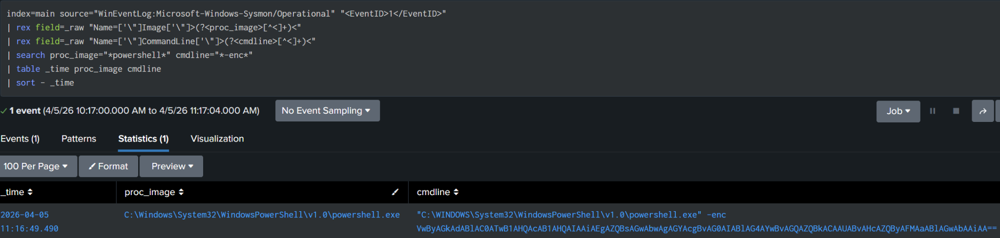
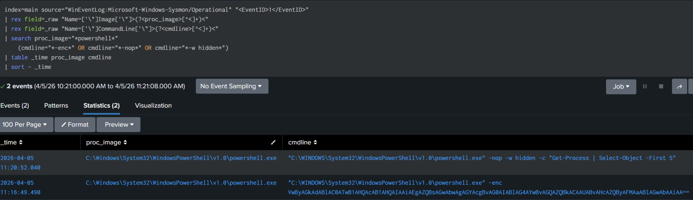
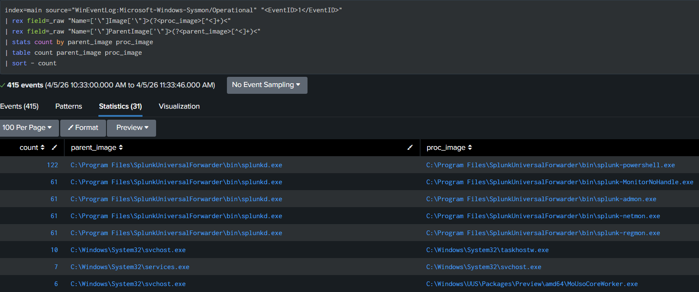
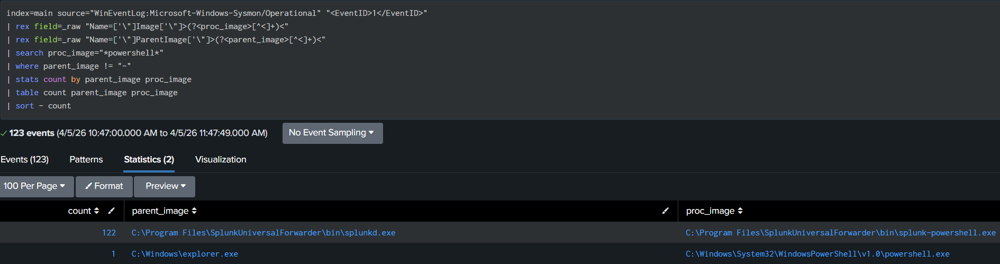
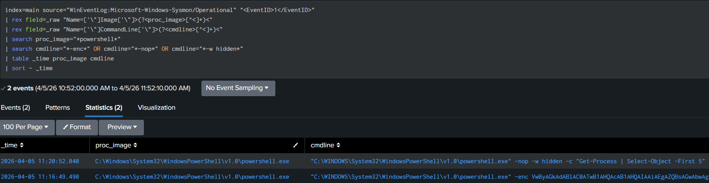

# Splunk + Sysmon Detection Lab

## Overview
This lab demonstrates detection engineering techniques using Sysmon telemetry ingested into Splunk.

The goal is to simulate common attacker behaviors and build detections based on process execution, command-line activity, and parent-child relationships.

## Environment
- Windows 11 VM (endpoint)
- Ubuntu VM (Splunk server)
- Splunk Enterprise
- Sysmon with custom configuration
- Splunk Universal Forwarder

## Data Source
- Microsoft-Windows-Sysmon/Operational (Event ID 1 - Process Creation)

## Techniques Covered
- T1059.001 - PowerShell
- T1218 - Signed Binary Proxy Execution (rundll32)
- Process injection patterns (basic observation)

## Key Skills Demonstrated
- Parsing raw XML logs in Splunk
- Field extraction using regex (rex)
- Process and command-line analysis
- Parent-child process relationships
- Detection logic development

## Example Detections
- Suspicious PowerShell flags (-nop, hidden)
- Encoded PowerShell execution
- rundll32 execution tracking

## Screenshots
### 1. Data Ingestion

Sysmon telemetry successfully ingested into Splunk via the Universal Forwarder from a Windows endpoint.

### 2. Raw Sysmon Event (Event ID 1)

Expanded Sysmon Event ID 1 (Process Creation) in raw XML format, validating event structure and field availability for detection development.

### 3. Field Extraction (Process + Command Line)

Extracted process image and command-line arguments from raw Sysmon XML logs using regex (rex), enabling structured analysis and detection development.

### 4. Detection Logic (PowerShell Activity)

Aggregated Sysmon process creation events to identify PowerShell execution frequency, demonstrating detection-focused analysis using field extraction and statistical grouping.

### 5. Detection Logic (PowerShell Execution Patterns)

This query identifies PowerShell execution activity and aggregates results by both process image and command-line arguments.
By grouping on `cmdline`, this step exposes variations in how PowerShell is executed, enabling visibility into different execution patterns (e.g., standard execution vs. scripted or parameterized usage).
This is critical for detection engineering, as adversaries often modify command-line arguments to evade simple detections.

### 6. Suspicious PowerShell Flags (Encoded Command)

This query identifies PowerShell executions that include the `-enc` flag, a common obfuscation technique used to conceal command content.
The presence of Base64-encoded arguments indicates potential attempts to evade detection by hiding execution intent within encoded payloads.
By extracting and analyzing command-line arguments from raw Sysmon XML, this step demonstrates how obfuscated execution can be surfaced through targeted detection logic.

### 7. Suspicious PowerShell Flags (Broader Detection)

- This query expands detection logic to identify multiple suspicious PowerShell execution flags, including `-enc`, `-nop`, and `-w hidden`.
- These flags are commonly associated with attacker tradecraft, enabling stealth execution, obfuscation, and evasion of basic monitoring controls.
- By correlating multiple indicators within command-line arguments, this step demonstrates a more comprehensive threat hunting approach beyond single-pattern detection.

### 8. Parent-Child Process Relationships

- This query analyzes process creation relationships by correlating parent and child processes within Sysmon Event ID 1 telemetry.
- By identifying which processes spawn PowerShell and other executables, this step provides insight into execution chains and potential abuse of legitimate processes.
- Parent-child relationships are a key component of threat hunting, as they help reveal suspicious process spawning patterns such as command-line interpreters launching PowerShell.

### 9. Parent Processes Spawning PowerShell

- This query focuses specifically on identifying which parent processes are responsible for spawning PowerShell executions.
- Filtering for PowerShell activity and grouping by parent-child relationships helps reveal execution chains and highlights how processes interact within the system.
- This type of analysis is critical for detecting suspicious behavior, as attackers often use legitimate parent processes to launch PowerShell in order to evade detection.

### 10. Suspicious PowerShell Execution Patterns

This query identifies PowerShell executions using commonly abused command-line flags associated with malicious activity.
Filters include:
- `-enc` (encoded commands)
- `-nop` (no profile execution)
- `-w hidden` (hidden window execution)
By isolating these patterns, this step highlights behaviors frequently observed in real-world attacks, demonstrating how command-line analysis can be used to detect suspicious activity within process execution logs.

## Author
Aaron

Cybersecurity professional with 20+ years of experience in digital forensics, incident response, and cybersecurity operations. Holds a Master’s degree in Cybersecurity Technology and CompTIA CySA+. Focused on detection engineering, threat hunting, and SOC workflows.
